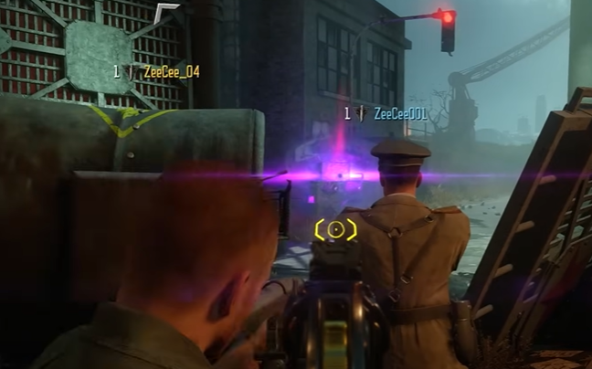
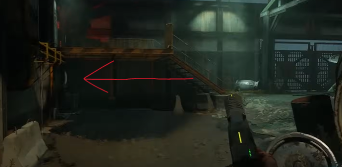
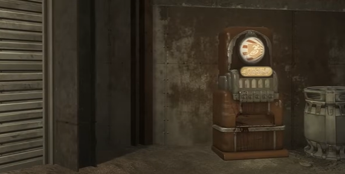
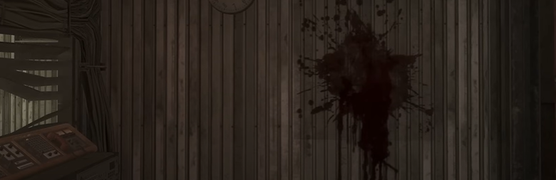
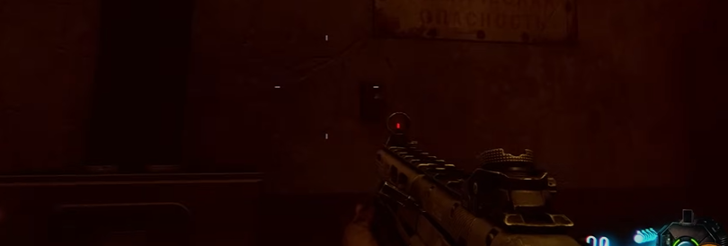
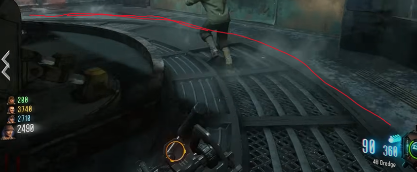
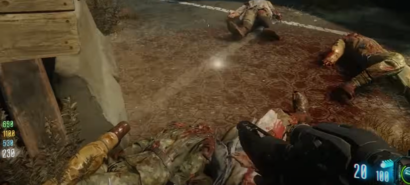
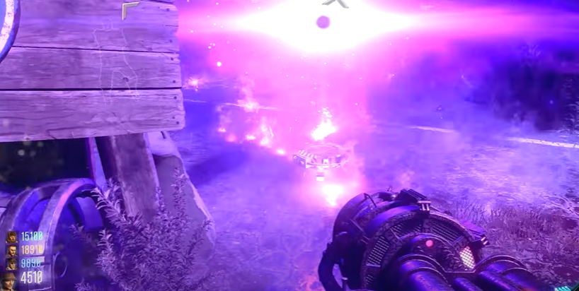

# Ascension Main Quest Guide

## Recomended setup:
* Immolation Liquidation

## Note:
* Need four players
* Hit box right away to get Gersch devices, Thunder gun, Dolls, Ray gun, and Raygun MKII for the last step mostly

## Steps

### Step 1:
Turn on power.

### Step 2:
Using a Gersch device throw it outside of the map by widows wine machine under the red traffic light at a generator:\
\
\
\
The generator will get sucked up by the void.

### Step 3:
Go to the stamin-up lander, under a staicase interact with a screen:\
\
\
\
an illuminati image will be displayed.

### Step 4:
Wait until a monkey round. During the monkey round all four team members will have to interact wth a button at the same time. It may take multiple attempts to properly time it up correctly.
#### Button locations:
On wall left of stamin-up machine:\
\
\
On the wall opposite of the juggernog machine:\
\
\
On the wall that is to the left of the widow's wine machine:\
\
\
On the wall accross the room from the speed cola machine:\
\
\
The step will be completed once the buttons sink into the wall.

### Step 5:
Have the entire team stand on the giant metal ring in the pack-a-punch room for one whole minute. No one can step off of it.\
\
\
\
A nuke will go off once the step is complete.

### Step 6:
Bring the lander into the spawn location. Have one (or more) teammate(s) stand in the lander while another calls that lander to the stamin-up location. The player in the lander should see a floating letter in the air and the lander will pass through it (interact just in case, probably not necessary), pick it up. repeat this process from stamin-up back to spawn, from spawn to speed cola, and from speed cola to stamin-up.

### Step 7:
At this point every team member needs either a Thunder gun, ray gun, or ray gun MKII. Make sure all weapons are pack-a-punched. One teammate will need a Gersch device and one other will need a doll. By the stamin-up lander there will be a glowing white orb on the ground.\
\
\
\
The teammate with the Gersch device will throw it on top of the orb while the teammate with the dolls will launch them onto the same spot (the dolls like to bounce watch out). Once the Gersch is active everyone will fire the wonder weapon at the orb for the duration of the Gersch.\
\
\
\
Be sure to unload at the ground where the orb is not anywhere else. Keep firing, don't stop until the Gersch runs out. This step will be complete once the orb floats into the sky.

## Step 8:
gg

